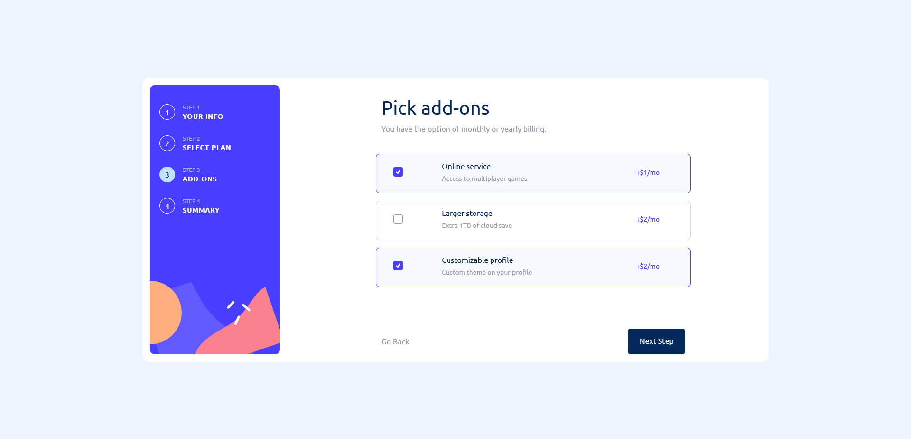

# Objective

Create a multi step form using TypeScript and React.

**[Live link](https://antran1245.github.io/multi-step-form/)**

# Technologies

## Run

`yarn start` or `npm start`

## Packages
- SASS
- react-boostrap
- bootstrap

# Screenshots

    <figure>
        
        <figcaption>Personal Info</figcaption>
    </figure>
    <figure>
        
        <figcaption>Personal Info Active</figcaption>
    </figure>

    <figure>
        
        <figcaption>Select your plan Active</figcaption>
    </figure>
    <figure>
        
        <figcaption>Select your plan Active Mobile</figcaption>
    </figure>

    <figure>
        
        <figcaption>Pick add-ons Active</figcaption>
    </figure>

    <figure>
        
        <figcaption>Finishing up</figcaption>
    </figure>
    <figure>
        
        <figcaption>Finishing up Mobile</figcaption>
    </figure>

    <figure>
        
        <figcaption>Thank you Mobile</figcaption>
    </figure>

# Credit

Project provided by [Frontend Mentor](https://www.frontendmentor.io/challenges/multistep-form-YVAnSdqQBJ)